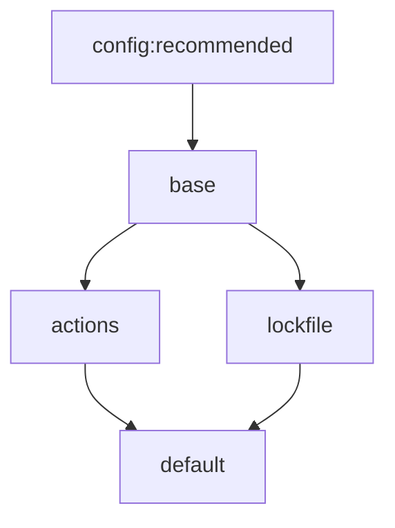

# rust-lang Renovate presets

Shared [Renovate](https://docs.renovatebot.com/) presets for repositories in the Rust Project, maintained
by the Infrastructure Team.

To know more about Renovate and how to use it in repositories of the Rust Project, see the
[Rust Forge documentation](https://forge.rust-lang.org/infra/docs/renovate.html).

> [!WARNING]
> These presets are intended for use within the Rust Project and we don't support their use outside of it.

## Quickstart

To use the default preset, add the following to your Renovate configuration file
(e.g. `.github/renovate.json5`):

```json
{
  "$schema": "https://docs.renovatebot.com/renovate-schema.json",
  "extends": ["github>rust-lang/renovate"]
}
```

If you want to learn how to customize Renovate's behavior, keep reading!

## Presets

- `base`: extends [`config:recommended`](https://docs.renovatebot.com/presets-config/#configrecommended),
  and enables [vulnerability alert](https://docs.renovatebot.com/configuration-options/#vulnerabilityalerts) PRs.
  Note that to receive vulnerability alert PRs, an admin needs to enable the
  settings [Dependency graph](https://docs.github.com/en/code-security/concepts/supply-chain-security/about-the-dependency-graph)
  and [Dependabot alerts](https://docs.github.com/en/repositories/managing-your-repositorys-settings-and-features/enabling-features-for-your-repository/managing-security-and-analysis-settings-for-your-repository).
- `actions`: enables GitHub Actions updates, pinning action digests to SemVer-compatible refs.
  All GitHub Actions updates are grouped into a single PR and scheduled weekly.
- `lockfile`: enables weekly lock file updates (e.g. `cargo update`) and disables
  PRs for non-breaking updates for Rust, JavaScript, and Python ecosystem packages.
  This is because lock file updates already include non-breaking updates.
  Breaking updates (e.g. `1.2.3` to `2.0.0`) are updated into separate PRs.
- `default`: This is the recommended preset for most repositories in the Rust Project.

Here's a diagram of the presets and how they extend each other
(e.g. `default` extends both `actions` and `lockfile`):



## Use a preset in a Repository

The [quickstart](#quickstart) section above shows how to use the `default` preset in a repository.

To use a different preset (e.g. `actions`), add the following to your Renovate configuration file:

```json
{
  "$schema": "https://docs.renovatebot.com/renovate-schema.json",
  "extends": ["github>rust-lang/renovate:actions"]
}
```

## Personalization

Presets won't work for all repositories. You can adopt them and customize them in your
repository by overriding specific configuration options.

### Schedule

Both the `actions` and `lockfile` presets default to Renovate's
[`schedule:weekly`](https://docs.renovatebot.com/presets-schedule/#scheduleweekly)
preset, which resolves to Monday before 4 AM.

To override them in a repository:

```json5
{
  "$schema": "https://docs.renovatebot.com/renovate-schema.json",
  "extends": ["github>rust-lang/renovate"],
  "lockFileMaintenance": {
    "extends": ["schedule:monthly"]
  },
  "packageRules": [
    {
      "matchManagers": ["github-actions"],
      "extends": ["schedule:monthly"]
    }
  ],
}
```

> [!NOTE]
> `schedule:monthly` means *"on the first day of the month, before 4AM"*.
> See the [Schedule Presets](https://docs.renovatebot.com/presets-schedule/#schedulemonthly) documentation for more details.

### Minimum release age

The [minimum release age](https://docs.renovatebot.com/key-concepts/minimum-release-age/)
option allows you to specify a minimum age for releases before Renovate considers them for updates.

```json5
{
  "minimumReleaseAge": "7 days",
}
```

We didn't set it as default because:

* You could miss security updates. If a GitHub repository isn't setup correctly
  or a security vulnerability isn't properly reported, Renovate won't update
  to the latest patched version.
* It could be confusing for maintainers.

We might enable this option in the future.

### Automerge

The [automerge](https://docs.renovatebot.com/configuration-options/#automerge)
option tells renovate to automatically merge PRs when CI checks pass and there are no conflicts.

```json5
{
  "automerge": true,
}
```

> [!NOTE]
> The `automerge` option is only available in the `renovate` GitHub App.
> If you use `forking-renovate`, this option is not available. See the [forge](https://forge.rust-lang.org/infra/docs/renovate.html?highlight=renovate#1-install-the-renovate-github-app) for more details.

Automerge is disabled by default.

## References

- [Shareable Config Presets](https://docs.renovatebot.com/config-presets/)
- [Schedule Presets](https://docs.renovatebot.com/presets-schedule/)
- [Configuration Options](https://docs.renovatebot.com/configuration-options/)
